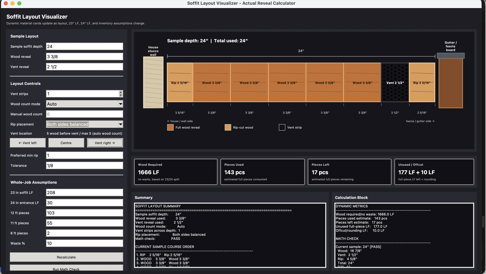

# Soffit Layout Visualizer & Inventory Calculator



An interactive engineering tool for planning wood soffit board and vent-strip layouts using real-world reveal widths and inventory management.

## 🚀 Setup & Installation

### 1. Install Python
Download and install Python (which includes `pip`) from the official website:
*   [python.org/downloads](https://www.python.org/downloads/) (Recommended: Python 3.8 or higher)

### 2. Install Dependencies
This app uses a `requirements.in` workflow to manage its environment. To set up the dependencies:

```bash
# 1. Install pip-tools (if not already installed)
pip install pip-tools

# 2. Compile the requirements
pip-compile requirements.in

# 3. Install the locked dependencies
pip install -r requirements.txt
```

## 🏃 How to Run
Once installed, launch the app from this directory:

```bash
python3 soffit-layout-visualizer.py
```

## ⚙️ Key Features

### 1. Dual-Depth Site Planning
*   **Split LF Calculation:** Separate inputs for the **Main House (23" depth)** and **Entrance (24" depth)** linear runs.
*   **Sample Layout:** A dedicated visualizer to test different board counts and vent positions for any specific depth.

### 2. Intelligent Material Math
*   **Wood Reveal:** Optimized for **3 3/8" (3.375")** actual installed reveal.
*   **Vent Reveal:** Standardized for **2 1/2" (2.5")** continuous vent strips.
*   **Rip-Cut Balancing:** Automatic calculation of rip-widths for "Both sides balanced" or specific edge placements (Wall vs. Fascia).

### 3. Inventory & Piece Allocation
*   **Smart Allocation:** Greedily estimates piece counts from your 12', 11', and 6' stock.
*   **Waste Management:** Configurable waste percentage with a whole-job coverage surplus/shortage report.
*   **Comparison Engine:** Compares linear requirements across different rip-placement strategies to minimize waste.

### 4. Math Verification System
*   **Automated Checks:** A one-click "Math Check" ensures that `(wood x count) + (vent x count) + (rip x count)` exactly matches the target depth for the sample, 23", and 24" runs.

---
Designed for high-precision architectural soffit installations.

## 📄 License
This project is licensed under the MIT License - see the [LICENSE](LICENSE) file for details. Free to use and copy with attribution.
